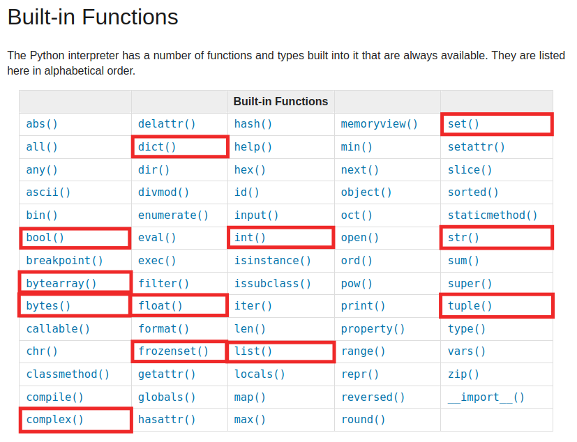
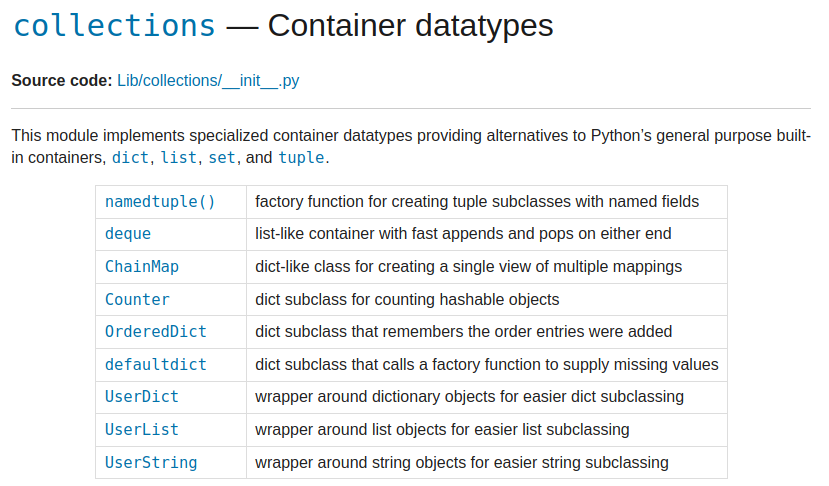

# Typy wbudowane i moduł `collections`
## Alek Gruszczyński
## 28.06.2021

---

# typy wbudowane

https://docs.python.org/3/library/functions.html

---
# typy niemutowalne
* `bool`
* `bytes`
* `complex`
* `float`
* `frozenset`
* `int`
* `str`
* `tuple`

---
# typy mutowalne
* `bytearray` 
* `dict`
* `list`
* `set`

---
# moduł collections

https://docs.python.org/3/library/collections.html

---
# namedtuple()

### Cechy
- prosty obiekt z dostępem do danych przez atrybuty (przez "kropkę")
- niemutowalny (jak tupla)

### Subiektywna opinia
- nieintuicyjny sposób inicjalizacji
- od Pythona 3.7 można uzyskać to samo (i więcej) z `dataclass`

### Przykład 0

---
# deque

### Cechy
- wymawia się "_dek_", czyli "double ended queue" (lista dwukierunkowa)
- lista ze zoptymalizowanym dodawaniem i usuwaniem elementów na początek i na koniec
- można ustawić maksymalną długość `maxlen`
- obszerna dokumentacja i "przepisy" (Recipes)

---
# ChainMap
- obiekt przechowujący listę par klucz-wartość
- umożliwia wyszukiwanie wartości pod kluczem w wielu słownikach i w zadanej kolejności
- umożliwia precyzyjne scalanie wielu słowników

### Przykład 1

---
# Counter
- klasa zliczająca ilość poszczególnych elementów w kolekcji
- wynik to słownik gdzie kluczem jest element, a wartością ilość wystąpień

### Subiektywna opinia
- Rozwiązuje w jednej linii maturalne zadanie "jaki jest najczęściej występujący element"

`Counter(lista_elementow).most_common(1)`

---
# OrderedDict
- słownik, który zachowuje kolejność wprowadzanych kluczy...
- ... tak jak każdy słownik od Pythona 3.6

### Czy `OrderedDict` jeszcze jest potrzebny?
- dwa obiekty `OrderedDict` są równe tylko, gdy mają te same klucze **w tej samej kolejności**
- `OrderedDict` umożliwia manipulację kolejnością kluczy

---
# defaultdict
- gdy dany klucz nie istnieje, `defaultdict` zwraca predefiniowaną wartość, zamiast rzucać wyjątek
- domyślna wartość będzie tworzona z obiektu callable (np. `list`, `dict`, ale też `lambda` **bez parametrów**)

### Przykład 2

---
# UserDict, UserList, UserString
- Obiekty umożliwiające stworzenie klasy dziedziczącej po odpowiednio `dict`, `list`, `str` (co było niemożliwe przed Pythonem 2.2)
- Obecnie wystarczy napisać `class MyDict(dict):`
- Każdy z trzech obiektów `User(...)` posiada atrybut `data` przechowujący zawartość obiektu w "oryginalnym" typie

---
# Pytania?

# Jeśli nie, dziękuję za uwagę :)